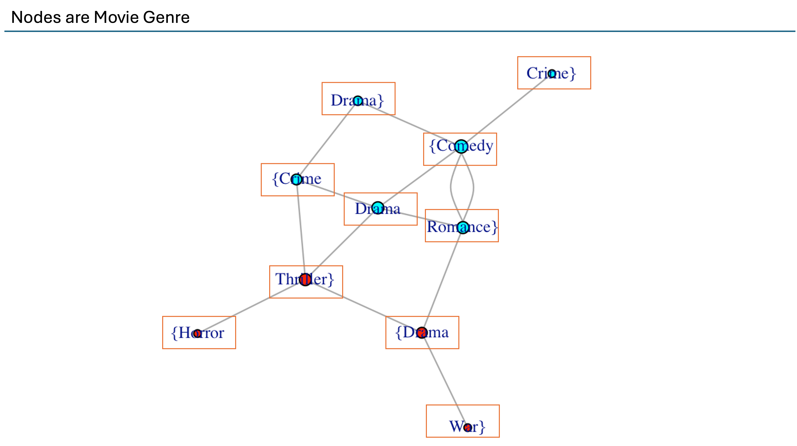
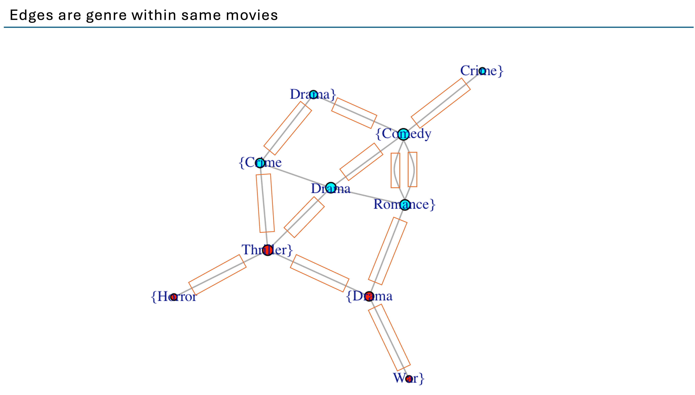
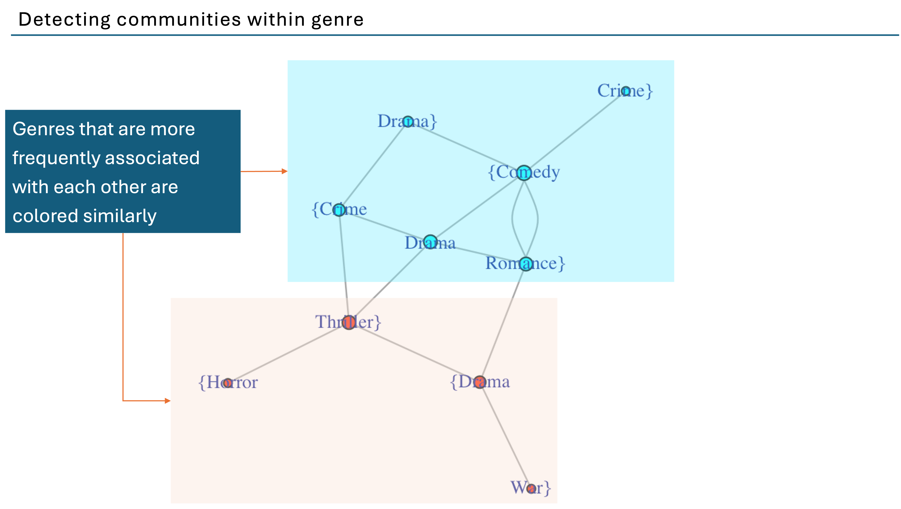
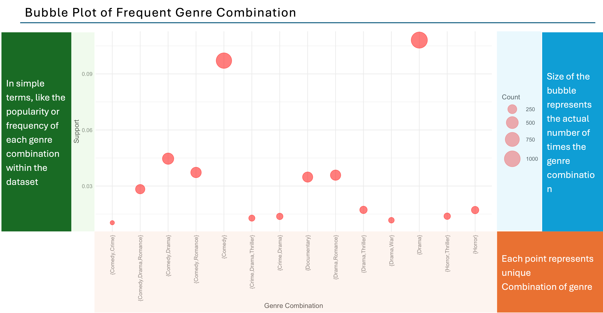
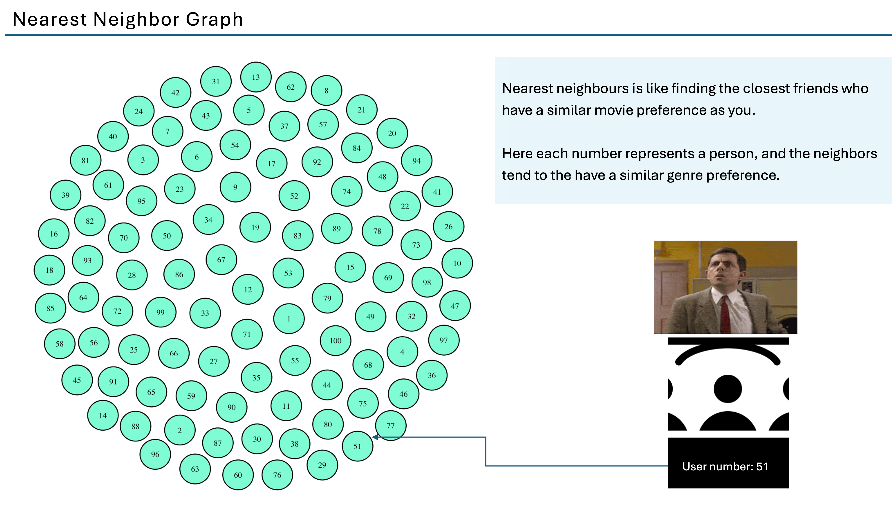
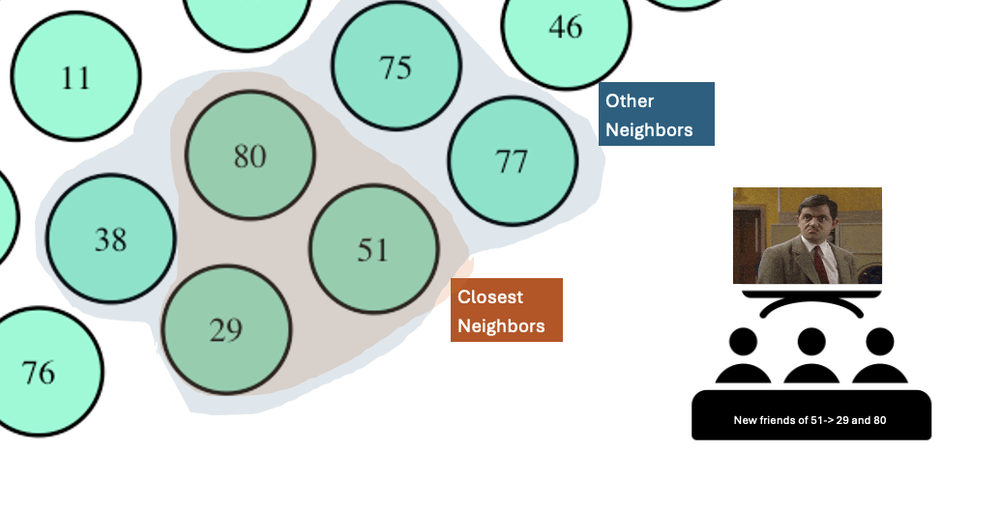

# Finding the right movie partner - Data driven approach

[](https://youtu.be/AoTW7juWQng)

[View PDF](finding_the_right_movie_partner.pdf)

## Overview

This project implements a data-driven approach to find the right movie partner and provide movie recommendations. It utilizes a subset of the MovieLens dataset to analyze user preferences, movie genres, and ratings to create a sophisticated recommendation system.

## Table of Contents

1. [Dataset](#dataset)
2. [Features](#features)
3. [Installation](#installation)
4. [Usage](#usage)
5. [Visualizations](#visualizations)
6. [Future Enhancements](#future-enhancements)

## Dataset

This project uses a subset of the MovieLens dataset (ml-latest-small), specifically:
- `ratings.csv`: Contains user ratings for movies
- `movies.csv`: Contains movie information including title and genres

The dataset includes:
- 100,836 ratings
- 9,742 movies
- 610 users
- Data created between March 29, 1996 and September 24, 2018

For more details about the full dataset, refer to the [original readme](https://www.kaggle.com/datasets/shubhammehta21/movie-lens-small-latest-dataset).

## Features

1. Data Cleaning and Preparation
2. Analysis of Movie Viewing and Rating Patterns
3. Genre Combination Analysis
4. User Similarity Matrix
5. Nearest Neighbor Recommendations

## Installation

To run this project, you need to have R installed along with the following packages:

```R
install.packages(c("arules", "arulesViz", "dplyr", "tidyr", "ggplot2", "igraph", "reshape2", "proxy"))
```

## Usage

1. Clone this repository
2. Set your working directory to the project folder
3. Ensure `movies.csv` and `ratings.csv` are in the correct directory
4. Run the main R script:

```R
source("Movie_Recommendation_Explained.R")
```

## Visualizations

### 1. Enhanced Network of Genre Combinations

This visualization represents:
- Nodes: Movie genres
- Edges: Genres within the same movies
- Colors: Genres more frequently associated with each other
- Node Size: Popularity or frequency of the genre





### 2. Bubble Plot of Frequent Genre Combinations

This plot shows:
- Each point: A unique combination of genres
- Y-axis: Support (popularity or frequency of the genre combination)
- Bubble Size: Count (number of occurrences of the genre combination)



### 3. Nearest Neighbor Graph

This graph illustrates:
- Nodes: Users
- Edges: Similarity between users based on movie preferences
- Proximity: Users with similar tastes are positioned closer together




## Future Enhancements

1. Time Series Analysis: Analyze ratings over time to create dynamic recommendations that evolve with trends.
2. Meta Data Integration: Incorporate movie metadata (e.g., director, cast, description) and use text mining and natural language processing for more nuanced recommendations.
3. FP-Growth Algorithm: Implement the FP-growth algorithm to improve efficiency in frequent itemset mining.

## License

This project is licensed under the terms provided in the original MovieLens dataset. For more details, refer to the [original README](https://www.kaggle.com/datasets/shubhammehta21/movie-lens-small-latest-dataset).

## Acknowledgments

- GroupLens Research Project at the University of Minnesota for providing the MovieLens dataset.
- F. Maxwell Harper and Joseph A. Konstan for their paper on MovieLens datasets.

## Citation

If you use this project or the MovieLens dataset, please cite:

> F. Maxwell Harper and Joseph A. Konstan. 2015. The MovieLens Datasets: History and Context. ACM Transactions on Interactive Intelligent Systems (TiiS) 5, 4: 19:1–19:19. https://doi.org/10.1145/2827872
